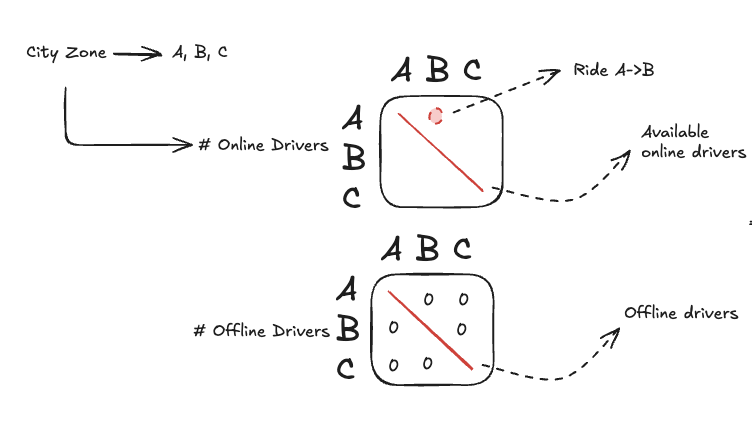
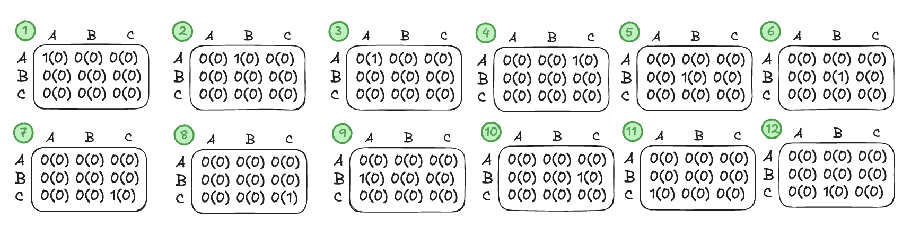
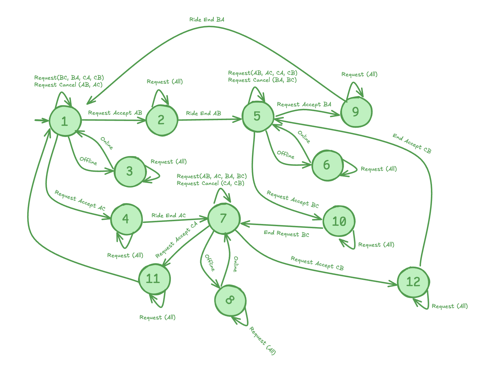
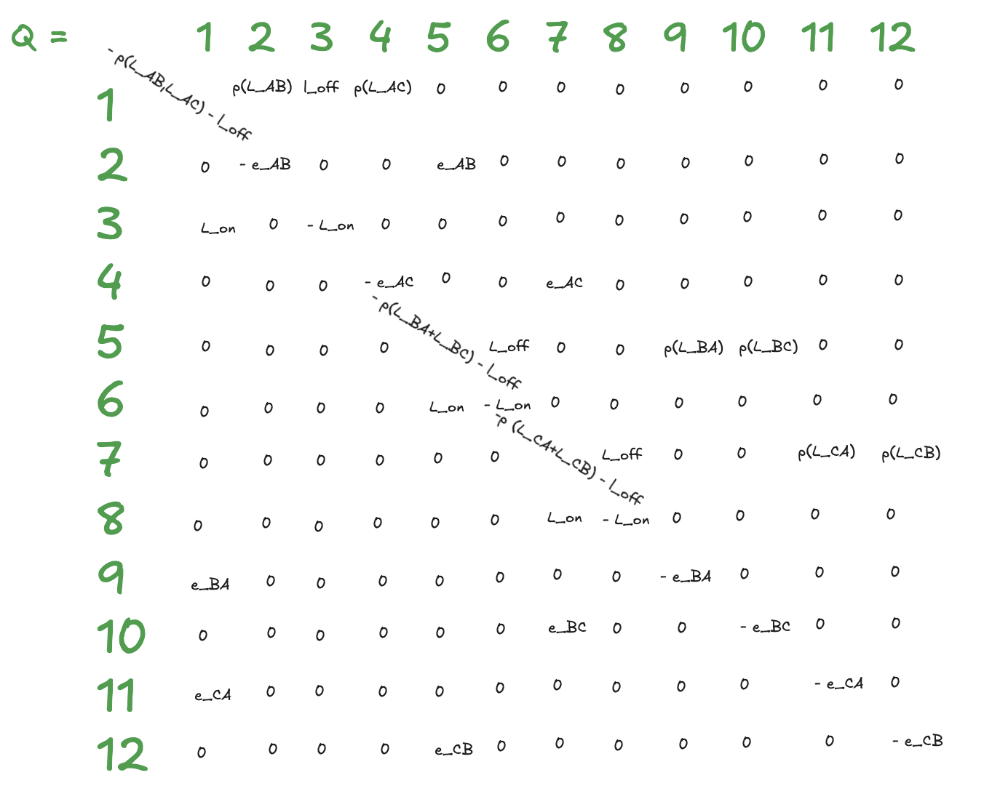
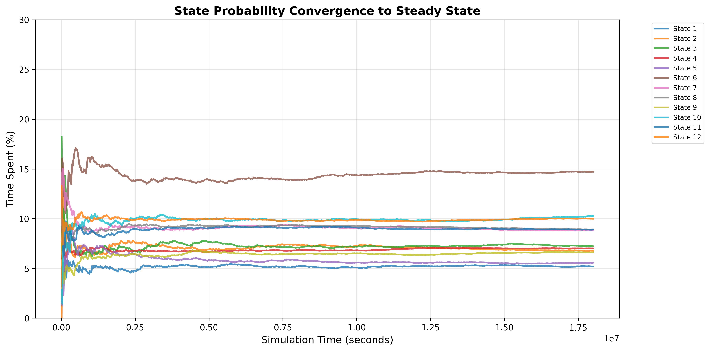

# DI_RideHailing - Discrete Event System Simulation

This project is a discrete event system simulation developed for the Discrete Event Systems course at Siena University. It simulates a simplified version of a ride-hailing company operating in a city divided into three zones (A, B, and C), modeling the behavior of drivers as they respond to ride requests, travel between zones, and transition between working and resting states. The simulation employs exponential distributions for request arrivals, service times, and work-rest cycles, with drivers having a configurable acceptance probability for incoming requests. The system is designed with an expandable architecture that allows for scaling to additional zones and multiple drivers, providing a foundation for analyzing steady-state behavior, state transitions, and system performance metrics in ride-hailing operations through discrete event modeling.

## Visualizations

### State Diagrams
The system models driver states and transitions between zones. States are represented as matrices where each entry corresponds to a specific zone-status combination (e.g., Working in Zone A, Resting in Zone B, Traveling from A to B).

---
### Steady-State Analysis (CTMC)
The system is modeled as a Continuous-Time Homogeneous Markov Chain (CTMC). The steady-state probabilities are computed by solving the balance equations using the transition rate matrix Q.

  
  

  <em>Left: State transition rate matrix Q | Right: Convergence to steady-state probabilities</em>

## Documentation

For detailed information about the system design, mathematical modeling, and analysis, please refer to the comprehensive report in the `report/` folder.
